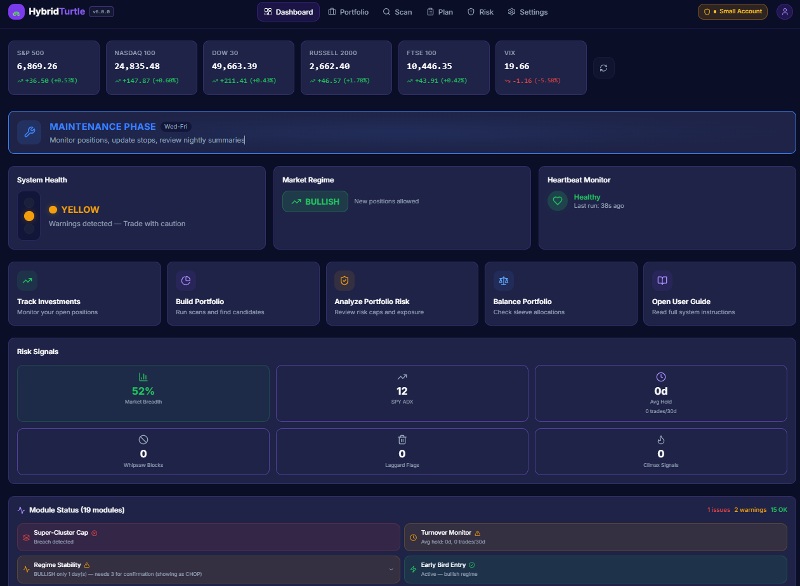

# HybridTurtle Trading Dashboard

> **⚠️ Disclaimer:** This software is **experimental** and provided **as-is** with no warranty of any kind. It is intended for educational and personal research purposes only. It does **not** constitute financial advice, and no guarantee is made regarding the accuracy, reliability, or completeness of any data or output. **Use entirely at your own risk.** The author(s) accept no liability for any financial losses, damages, or other consequences arising from the use of this software. Always do your own research and consult a qualified financial adviser before making investment decisions.


Systematic trading workspace built around a Hybrid Turtle process: scan opportunities, enforce risk rules, plan weekly execution, and manage positions with disciplined stop logic.

## Preview



## Why this project exists

HybridTurtle helps turn discretionary trading into a repeatable workflow:

- structured weekly cycle: Think → Observe → Act → Manage
- risk-first execution with hard safety constraints
- scan pipeline to rank and filter candidates
- portfolio visibility with stop protection progress
- optional Trading 212 sync and nightly automation

## Core capabilities

- **7-stage scan engine** for candidate discovery and qualification
- **Dual Score system** (BQS / FWS / NCS) for quantitative screening
- **17-phase prediction engine** adding conformal intervals, failure mode scoring, dynamic signal weighting, adversarial stress testing, signal pruning, danger detection, lead-lag analysis, GNN graph analysis, Bayesian belief tracking, Kelly sizing, Meta-RL trade management, VPIN order flow, sentiment fusion, TDA regime detection, execution quality, TradePulse synthesis, and causal invariance filtering
- **TradePulse Dashboard** — unified confidence score (A+ to D grading) per ticker
- **Cross-Reference engine** to reconcile scan and dual score recommendations
- **Risk controls** (position sizing, open risk caps, concentration limits)
- **Portfolio management** with stop updates and R-multiple tracking
- **Plan workspace** for pre-trade checks and weekly execution
- **Dashboard command center** with health, regime, heartbeat, and modules
- **Market danger detection** — immune system matching current conditions to historical crises
- **Automation hooks** for nightly checks and Telegram notifications

## Quick start (Windows)

### 1) Install (one-time)

1. Install **Node.js 20 or 22 LTS** — download from https://nodejs.org (choose the **LTS** tab).
2. Double-click **`install.bat`**.
3. Wait for it to finish — it installs dependencies, creates the database, generates secrets, and puts a shortcut on your Desktop.

That's it. The installer creates a `.env` file automatically with secure defaults. You don't need to edit any config files to get started.

> **Advanced:** If you want to customise settings (e.g. Telegram alerts, alternative data provider), see [Environment variables](#environment-variables) below or edit `.env` manually. You can also copy `.env.example` to `.env` **before** running the installer to start from a template instead.

## Deployment

Docker deployment, CI, and cloud self-hosting notes: [docs/DEPLOYMENT.md](docs/DEPLOYMENT.md).

Core CI test command: `npm run test:unit`

Current constraint: the checked-in Prisma schema is still SQLite-backed, so the stable container runtime in this workspace uses the existing SQLite database file. A Postgres service is scaffolded in Docker Compose for future migration work, but the app is not yet switched to a Postgres Prisma provider.

### 2) Launch (daily)

- Double-click the **"HybridTurtle Dashboard"** shortcut on your Desktop.
- Or double-click `start.bat` in the project folder.
- Your browser opens automatically to http://localhost:3000/dashboard.
- **Keep the black terminal window open** while using the dashboard — closing it stops the server.

### Launcher files

| File | Purpose |
|------|---------|
| `install.bat` | First-time setup (deps, database, desktop shortcut) |
| `start.bat` | Primary daily launcher |
| `run-dashboard.bat` | Compatibility alias (redirects to `start.bat`) |
| `nightly.bat` | Compatibility alias (redirects to `nightly-task.bat`) |
| `seed-tickers.bat` | Re-seed ticker universe from Planning files |
| `update.bat` | Update dependencies/database after pulling new code |
| `nightly-task.bat` | Run nightly automation checks (schedulable via Task Scheduler) |
| `package.bat` | Package the app into a distributable zip (excludes database, secrets, node_modules) |
| `register-nightly-task.bat` | Register the nightly cron as a Windows Task Scheduler entry |
| `watchdog-task.bat` | Check for missed nightly/midday heartbeats, send Telegram alert |
| `register-watchdog-task.bat` | Register watchdog as a Windows Task Scheduler entry (10:00 AM daily) |
| `midday-sync-task.bat` | Lightweight intra-day T212 position sync (stop-out detection) |
| `register-midday-sync.bat` | Register midday sync as a Windows Task Scheduler entry |
| `fix-account-types.bat` | Fix ISA vs Invest account type mismatches on positions |
| `restore-backup.bat` | Restore database from a backup (emergency use) |

## Environment variables

The installer creates `.env` automatically with working defaults. You only need this section if you want to customise behaviour.

To start from the template instead, copy `.env.example` to `.env` before running `install.bat`. Required variables are marked with **★** (all are auto-generated by the installer).

| Variable | Required | Default | Description |
|----------|----------|---------|-------------|
| `DATABASE_URL` | ★ | `file:./dev.db` | SQLite database path — no external DB needed |
| `NEXTAUTH_SECRET` | ★ | — | Random secret for session signing (change in production) |
| `CRON_SECRET` | ★ | — | Secret protecting the `/api/nightly` endpoint |
| `NEXTAUTH_URL` | | `http://localhost:3000` | Base URL for NextAuth callbacks |
| `TELEGRAM_BOT_TOKEN` | | — | Telegram bot token for nightly alerts (see below) |
| `TELEGRAM_CHAT_ID` | | — | Telegram chat ID for alert delivery |
| `BROKER_ADAPTER` | | `disabled` | Broker adapter mode — `disabled` (safe no-op), `mock` (demo data), or `trading212` (live) |
| `MARKET_DATA_PROVIDER` | | `yahoo` | Market data source — `yahoo` (default) or `eodhd` |
| `EODHD_API_KEY` | | — | EODHD API key (required only when `MARKET_DATA_PROVIDER=eodhd`) |
| `T212_INVEST_API_KEY` | | — | Trading 212 Invest API key (alternative to storing in DB via Settings) |
| `T212_ISA_API_KEY` | | — | Trading 212 ISA API key (alternative to storing in DB via Settings) |
| `T212_INVEST_ACCOUNT_ID` | | — | Trading 212 Invest account ID |
| `T212_ISA_ACCOUNT_ID` | | — | Trading 212 ISA account ID |
| `NIGHTLY_CRON` | | `30 21 * * *` | Cron expression for nightly run (default 9:30 PM UK) |
| `BROKER_SYNC_CRON` | | `0 45 22 * * 1-5` | Cron schedule for automated broker sync |
| `MARKET_DATA_NIGHTLY_CRON` | | `0 30 22 * * 1-5` | Cron schedule for nightly market data refresh |
| `AUTO_STOPS_CRON` | | `0 0 * * * 1-5` | Cron schedule for auto-stop ratchet (default: top of every hour, weekdays) |
| `USE_PRIOR_20D_HIGH_FOR_TRIGGER` | | — | Feature flag: use prior day's 20-day high for entry trigger instead of live day |
| `EMAIL_SMTP_HOST` | | — | SMTP host for optional email alerting (experimental) |
| `MODEL_SERVICE_URL` | | `http://localhost:8000` | Optional external model-service base URL for deployment smoke tests |
| `ENABLE_ML_SCORING` | | `false` | Reserved feature flag for external model-service scoring |
| `ENABLE_BROKER_TRADING` | | `false` | Explicit live-broker enablement guard |
| `ENABLE_AUTO_SUBMISSION` | | `false` | Explicit automation enablement guard |

## Telegram notifications (optional)

The nightly automation can send alerts covering stop changes, laggard warnings, climax-top signals, swap suggestions, whipsaw blocks, breadth safety, and ready-to-buy candidates.

### Setup

1. Create a bot with **@BotFather** on Telegram (`/newbot`) and copy the token.
2. Send at least one message to your new bot.
3. Get your chat ID by visiting `https://api.telegram.org/bot<TOKEN>/getUpdates`.
4. Add both values to `.env`:
   ```
   TELEGRAM_BOT_TOKEN="your-token"
   TELEGRAM_CHAT_ID="your-chat-id"
   ```
5. Restart with `start.bat`.
6. Test from **Settings → Telegram Notifications → Send Test Message** in the dashboard.
7. To automate nightly delivery, run `install.bat` and choose **Y** for the nightly Task Scheduler entry.

## Project structure

```
├── prisma/              # Database schema, migrations, seed scripts
├── Planning/            # Ticker lists, cluster maps, region maps
├── scripts/             # Audit harness and maintenance scripts
├── reports/             # Regeneratable audit snapshot
├── public/              # Static assets
├── docs/                # Images and supplementary docs
├── src/
│   ├── app/             # Next.js App Router (pages + API routes)
│   │   ├── api/         # REST endpoints (see API routes below)
│   │   ├── backtest/    # Signal replay & quality audit
│   │   ├── causal-audit/ # IRM invariance analysis
│   │   ├── dashboard/   # Main command center
│   │   ├── execution-quality/ # Slippage & timing analysis
│   │   ├── notifications/ # Notification inbox
│   │   ├── portfolio/   # Position management
│   │   ├── scan/        # Scan engine UI
│   │   ├── signal-audit/ # MI-based signal pruning analysis
│   │   ├── plan/        # Weekly execution workspace
│   │   ├── risk/        # Risk overview
│   │   ├── trade-log/   # Trade journal
│   │   ├── trade-pulse/ # Full TradePulse confidence dashboard
│   │   ├── settings/    # App configuration
│   │   ├── login/       # Authentication
│   │   └── register/    # User registration
│   ├── components/      # React components (by feature)
│   ├── cron/            # Nightly automation entry point
│   ├── hooks/           # Custom React hooks
│   ├── lib/             # Core business logic
│   │   ├── modules/     # Modular engine plugins (19 active + 2 disabled modules)
│   │   ├── prediction/  # 14-phase prediction engine (conformal, failure modes, GNN, etc.)
│   │   └── signals/     # Additional signal layers (VPIN, sentiment)
│   ├── store/           # Zustand state management
│   └── types/           # Shared TypeScript types
```

## API routes

All routes are under `/api`. Key endpoint groups:

| Route | Purpose |
|-------|---------|
| `/api/auth` | NextAuth authentication |
| `/api/health-check` | System health diagnostics |
| `/api/heartbeat` | Liveness ping |
| `/api/market-data` | Yahoo Finance price/quote proxy |
| `/api/modules` | Dashboard module data (5 min server cache, parallelised) |
| `/api/nightly` | Nightly automation trigger |
| `/api/plan` | Weekly execution plans |
| `/api/notifications` | Notification inbox (trade alerts, stop warnings, system events) |
| `/api/portfolio` | Portfolio overview & metrics |
| `/api/positions` | Position CRUD & stop management |
| `/api/publications` | Activity feed (heartbeats, health checks, stop moves, position events) |
| `/api/risk` | Risk calculations & gates |
| `/api/scan` | Scan engine execution & results |
| `/api/scan/progress` | Scan progress polling (JSON GET) |
| `/api/settings` | User settings & preferences |
| `/api/stocks` | Ticker universe queries |
| `/api/stops` | Stop price history |
| `/api/trade-log` | Trade journal entries |
| `/api/trading212` | Trading 212 connect & sync |
| `/api/backtest` | Signal replay & quality audit |
| `/api/ev-stats` | Expected value statistics |
| `/api/prediction/*` | Prediction engine (conformal, failure modes, stress test, GNN, beliefs, Kelly, trade-pulse, etc.) |
| `/api/signals/*` | Signal runs, VPIN order flow, sentiment fusion |
| `/api/workflow/tonight` | Tonight's workflow card data and run |
| `/api/plans/:id` | Planned trade updates (PATCH) |
| `/api/broker/orders` | Broker order listing |
| `/api/audit-events` | Audit event log |

## Documentation

- [USER-GUIDE.md](USER-GUIDE.md) — complete end-user guide (non-technical)
- [SETUP-README.md](SETUP-README.md) — concise setup + troubleshooting
- [DASHBOARD-GUIDE.md](DASHBOARD-GUIDE.md) — full feature and operations reference
- [TRADING-LOGIC.md](TRADING-LOGIC.md) — trading rules, risk logic, and system constraints
- [CLAUDE.md](CLAUDE.md) — AI agent context file: architecture, risk rules, and coding standards

## Performance notes

The dashboard relies on `/api/modules` which runs 21 module checks including several Yahoo Finance calls. To keep load times low:

- **Parallelised external calls** — breadth calculation, climax scan, dual-regime detection, fast-follower scan, re-entry scan, SPY ADX, and pyramid ATR fetches all run concurrently via `Promise.allSettled`.
- **Shared data** — SPY historical bars are fetched once and reused for both ADX and dual-regime calculations.
- **Server-side response cache** — the `/api/modules` result is cached for 5 minutes so repeat visits within a session don't re-run everything.
- **Client-side TTL** — the Zustand store marks module data stale after 10 minutes; the `useModulesData` hook prevents concurrent duplicate fetches.
- **Yahoo Finance caching** — quote data is cached for 30 minutes, historical bars for 24 hours, and FX rates for 30 minutes (all in-process memory). All Yahoo calls are wrapped in `withRetry()` for automatic retry on transient errors (429, 5xx, network) with exponential backoff.
- **Data freshness tracking** — `getDataFreshness()` returns LIVE, CACHE, or STALE_CACHE with age. Dashboard and nightly alerts surface stale data warnings.
- **Tuesday forced refresh** — on execution day (Tuesday), key Yahoo fetch functions bypass cache to ensure live prices for position sizing.
- **No auto-polling** — data is fetched once when the dashboard loads. Manual refresh buttons on the market bar and hedge card let you pull fresh data on demand. This suits an infrequent-use pattern (checking once or twice a day).

On first server start with an empty cache, background pre-caching fetches historical bars for all active tickers so the first dashboard load doesn't trigger hundreds of sequential chart calls.

## Tech stack

- Next.js 14 + React 18
- Prisma + SQLite (local)
- TailwindCSS
- Zustand (state management)
- Recharts + lightweight-charts
- Zod (runtime validation)
- Vitest (unit tests)

## Developer commands

### Verification and tests

```bash
npm run test:unit
npm run build
```

### Docker runtime

```bash
docker compose up --build app
docker compose --profile model up --build
```

```bash
# Start dev server
npm run dev

# Production build & start
npm run build
npm run start

# Run lint and unit tests
npm run lint
npm run test:unit
npm run test:unit:watch   # watch mode

# Audit harness
npm run audit:harness

# Prisma workflow
npx prisma generate
npx prisma migrate deploy     # Apply pending schema migrations
npx prisma db seed
npm run db:studio         # launch Prisma Studio GUI
```

## Troubleshooting

### "Node.js not found"
Download and install from https://nodejs.org (choose the **LTS** version). Close and re-open the terminal, then try again.

### "npm install failed"
- Run `install.bat` as Administrator (right-click → Run as administrator).
- Temporarily disable antivirus software.
- Ensure you have internet access.

### "Prisma engines do not seem to be compatible" / "not a valid Win32 application"
This means the Prisma database engine doesn't match your Node.js architecture. Usually caused by having 32-bit Node.js on a 64-bit machine.
1. Check your architecture: open a terminal and run `node -e "console.log(process.arch)"`
2. If it says `ia32` instead of `x64` — uninstall Node.js, then download and install the **64-bit (x64)** version from https://nodejs.org
3. Delete the `node_modules` folder and run `install.bat` again

If the architecture is already `x64`, the binary may be corrupted (e.g. antivirus quarantine). Delete `node_modules\.prisma`, then run `npx prisma generate`.

### "Port 3000 already in use"
`start.bat` handles this automatically. If it persists, open Task Manager (Ctrl+Shift+Esc), end any **Node.js** processes, and try again.

### Dashboard shows no data
Go to the **Scan** page, click **Run Full Scan** to fetch live data from Yahoo Finance. The first scan may take 2–3 minutes for all tickers.

### Need to reset the database
Delete `prisma/dev.db` and run `install.bat` again.

## Contributing

This is a private project. For AI agents contributing to the codebase, see [CLAUDE.md](CLAUDE.md) for architecture, risk rules, and coding standards.

## License

This software is **private and proprietary**. It is not open-source and may not be redistributed, modified, or used without permission from the author(s).
